# Custom Google Form + Google Sheets Integration

This guide explains how to replace Google Form’s default UI with a **custom HTML form** while still sending responses to **Google Sheets**.

We’ll use **Google Apps Script** as a proxy so you can:

- Fully control the form’s styling and layout
- Keep responses stored in your existing Google Form → Google Sheet
- Embed the form on WordPress (via Gutenberg Custom HTML) or any site

---

## 📌 Overview

- **Google Form** → used only as the backend storage.
- **Google Apps Script** → proxy to fetch the `fbzx` token and forward submissions.
- **Custom HTML Form** → your styled frontend, embeddable anywhere.

### 🔗 Flow Diagram

```mermaid
flowchart LR
    A[🖥️ User Fills Custom Form] --> B[🌐 Apps Script Proxy]
    B --> C[📄 Google Form Backend]
    C --> D[📊 Google Sheets Storage]
```



---

## 1) Create Your Google Form

1. Go to Google Forms.
2. Create the fields you need (e.g., First Name, Last Name, Email, Instagram).
3. Copy your Form ID from the URL: `https://docs.google.com/forms/d/e/<FORM_ID>/viewform`
   Example: `1FAIpQLSeaRpf3W4rOOdjcbIRp5jcbGNHJVIAC1mO7O27ZGrNJez2x_g`
4. Find each field’s entry ID by inspecting the live form (look for attributes like `name="entry.2005620554"`).

**Important Form Settings**

- Collect email addresses → OFF
- Limit to 1 response → OFF
- Accepting responses → ON

---

## 2) Set Up the Google Apps Script Proxy

Google Forms requires a fresh `fbzx` token per session. The proxy fetches it for every submission and forwards your payload to the form.

1. Open Google Apps Script → New project.
2. Paste:

```javascript
const FORM_ID = "1FAIpQLSeaRpf3W4rOOdjcbIRp5jcbGNHJVIAC1mO7O27ZGrNJez2x_g";
const VIEW_URL = `https://docs.google.com/forms/d/e/${FORM_ID}/viewform`;
const POST_URL = `https://docs.google.com/forms/d/e/${FORM_ID}/formResponse`;

function doPost(e) {
  try {
    const html = UrlFetchApp.fetch(VIEW_URL).getContentText();
    const m = html.match(/name=['"]fbzx['"]\s+value=['"]([^'"]+)['"]/i);
    if (!m) return _out("ERR: fbzx not found");

    const fbzx = m[1];
    const payload = Object.assign({}, e.parameter, {
      fbzx,
      fvv: "1",
      draftResponse: "[]",
      pageHistory: "0",
    });

    const res = UrlFetchApp.fetch(POST_URL, {
      method: "post",
      payload,
      followRedirects: true,
      muteHttpExceptions: true,
    });

    const code = res.getResponseCode();
    if (code === 200 || code === 302) return _out("OK");
    return _out(`ERR: ${code} - ${res.getContentText().slice(0, 200)}`);
  } catch (err) {
    return _out("ERR: " + err);
  }
}

function doGet() {
  return _out("OK");
}
function _out(msg) {
  return ContentService.createTextOutput(msg).setMimeType(
    ContentService.MimeType.TEXT
  );
}
```

3. Deploy → New deployment → type Web app
   - Execute as: Me
   - Who has access: Anyone (or Anyone with the link)
   - Copy the Deployment URL ending with `/exec`.

Heads-up: Every time you edit the script, redeploy and update the `/exec` URL you use in your form.

---

## 3) Build Your Custom HTML Form

Point your custom form to the Apps Script `/exec` URL. This example keeps things minimal and uses a hidden iframe to avoid page redirects.

```html
<!DOCTYPE html>
<html lang="en">
  <head>
    <meta charset="UTF-8" />
    <title>Custom Google Form</title>
    <style>
      body {
        font-family: system-ui, Arial, sans-serif;
        background: #f9f9fb;
        padding: 2rem;
      }
      form {
        max-width: 520px;
        margin: auto;
        background: #fff;
        padding: 20px;
        border-radius: 12px;
        box-shadow: 0 6px 24px rgba(0, 0, 0, 0.06);
      }
      label {
        display: block;
        margin: 12px 0 6px;
        font-weight: 600;
      }
      input,
      textarea {
        width: 100%;
        padding: 12px;
        border: 1px solid #dcdfe6;
        border-radius: 8px;
      }
      button {
        margin-top: 14px;
        padding: 12px 18px;
        border: 0;
        border-radius: 999px;
        background: #635bff;
        color: #fff;
        font-weight: 700;
        cursor: pointer;
      }
      button:hover {
        filter: brightness(1.05);
      }
    </style>
  </head>
  <body>
    <form
      action="YOUR_APPS_SCRIPT_EXEC_URL"
      method="POST"
      target="hidden_iframe"
    >
      <label>First Name</label>
      <input type="text" name="entry.2005620554" required />

      <label>Last Name</label>
      <input type="text" name="entry.801260995" required />

      <label>Email</label>
      <input type="email" name="entry.1045781291" required />

      <label>Instagram Username</label>
      <input type="text" name="entry.1166974658" />

      <label>Message</label>
      <textarea name="entry.839337160" rows="6"></textarea>

      <button type="submit">Submit</button>
    </form>

    <!-- Hidden iframe keeps user on your page -->
    <iframe name="hidden_iframe" style="display:none;"></iframe>
  </body>
</html>
```

- Replace `YOUR_APPS_SCRIPT_EXEC_URL` with your web app’s `/exec` URL.
- Ensure your input `name` attributes match the form’s `entry.##########` IDs.

---

## 4) (Optional) WordPress (Gutenberg)

1. Add a Custom HTML block in the editor.
2. Paste only the `<form>...</form>` + `<iframe>` portion (or the entire HTML if you prefer).
3. Publish → test.

---

## 5) Debugging

- **Not receiving responses?**
  - In Google Form, disable `Collect email addresses` and `Limit to 1 response`.
- **Only one submission per browser?**
  - Caused by a stale `fbzx`. The proxy above fetches a fresh token each time.
- **Changes not applying?**
  - After every Apps Script edit: Deploy → New Deployment (or “Manage deployments → Edit → Deploy”) and update the `/exec` URL in your form.
- **Seeing nothing because of the hidden iframe?**
  - Temporarily make it visible to read the proxy’s response:
    `<iframe name="hidden_iframe" style="width:100%;height:160px;border:1px solid #ddd;"></iframe>`

---

## 🎬 Step-by-Step Demo

Here is a visual guide to setting up your custom form.

### 1) Create Google Form & Get Entry IDs

First, create your form in Google Forms and identify the unique `entry.########` ID for each input field by inspecting the live form.


Make sure to configure the settings correctly.


### 2) Build & Deploy Apps Script Proxy

Next, set up the Google Apps Script to act as a proxy. This script fetches a required token and forwards your form submissions to the Google Form backend.

_(No image available for this step.)_

### 3) Wire Your Custom Form to the Script

Update your HTML form's `action` attribute to point to your deployed Apps Script URL. Here's an example of what the custom form can look like:


### 4) Confirm Responses in Google Sheets

Finally, after a user submits the form, the data will appear in the Google Sheet linked to your Google Form.


### Full Video Demo

A full screen recording of the process is available here:
[Link to video](assets/images/Screen%20Recording%202025-08-18%20at%201.19.36%E2%80%AFAM.mov)

---

## 🛠 Troubleshooting (Common Errors & Fixes)

| Issue                              | Likely Cause                                         | Fix                                                                                     |
| ---------------------------------- | ---------------------------------------------------- | --------------------------------------------------------------------------------------- |
| Responses not showing in Sheets    | `Collect email addresses` is ON; validation mismatch | Turn OFF “Collect email addresses”. Check `entry.########` names and `required` fields. |
| Only one submission per browser    | Stale `fbzx`                                         | Use the Apps Script proxy (fetch fresh `fbzx` each submit).                             |
| Changes to Apps Script don’t apply | Old deployment still active                          | Redeploy and update `/exec` in your form.                                               |
| Permission / CORS errors           | Web app access not public                            | Deploy as Web app → `Anyone` (or “Anyone with the link”).                               |
| Nothing appears (silent)           | Hidden iframe hides errors                           | Temporarily make the iframe visible to inspect the response.                            |
| Form redirects to Google           | No iframe `target`                                   | Add `target="hidden_iframe"` and include the `<iframe name="hidden_iframe">`.           |

---

## Project Structure:

```
/
├─ index.html               # The custom HTML form
├─ instructions.md          # The original instructions
├─ readme.md                # This file
└─ assets/
   ├─ styles.css
   └─ images/
      ├─ Contact Sheet.png
      ├─ Forms Dashboard.png
      ├─ image.png
      ├─ Settings.png
      └─ ...
```

---

## ✅ Conclusion

You now have:

- A custom-designed form embedded on your site
- Submissions saved in Google Sheets automatically
- A reusable pattern you can drop into any project

Enjoy your fully branded form with Google’s reliability under the hood!
